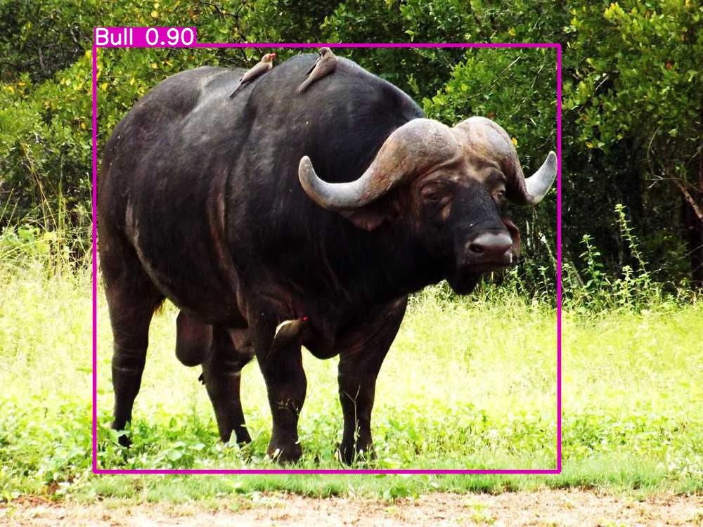
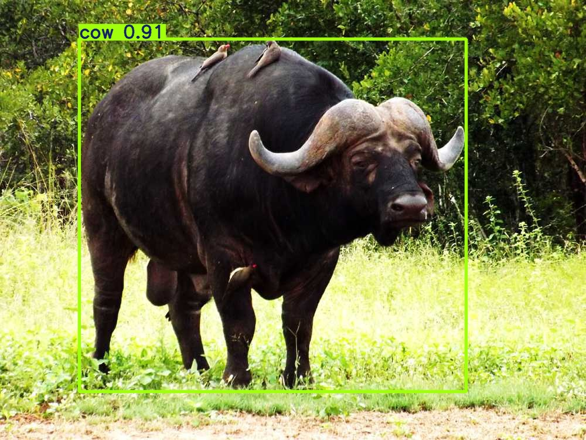

# Open-Images vs. COCO: YOLO Pretrained Models Analysis

This project compares the performance of YOLO pretrained models on object detection tasks using two prominent datasets: **Open Images** and **COCO**. The analysis includes evaluating the working of YOLO on images and video data to provide insights into the efficiency, accuracy, and applicability of the models in different scenarios.

## Table of Contents

1. [Introduction](#introduction)
2. [Datasets](#datasets)
3. [Models](#models)
4. [Evaluation Metrics] (#evaluation)
5. [Results] (#results)
---

## Introduction

YOLO (You Only Look Once) is a state-of-the-art, real-time object detection algorithm. This project evaluates its performance on two widely-used datasets:
- **Open Images**: A large-scale dataset with diverse object annotations.
- **COCO (Common Objects in Context)**: A benchmark dataset for object detection with a focus on everyday scenes.

The analysis explores object detection for both images and videos, aiming to highlight model strengths, weaknesses, and dataset-specific challenges.

---

## Datasets

### Open Images
- Contains annotated images with bounding boxes, object labels, and hierarchical object relationships.
- Designed for large-scale training and evaluation.

### COCO
- Features object-centric annotations in natural, cluttered scenes.
- Includes both bounding box and segmentation masks for complex evaluation.

---

## Models

YOLO models used in the analysis:

### COCO Models
- **yolo11l.pt**: Large model for high accuracy.
- **yolo11n.pt**: Nano model optimized for speed with reduced complexity.
- **yolo11s.pt**: Small model balancing accuracy and speed.

### Open Images Models
- **yolov8l-oiv7.pt**: Large model trained specifically on Open Images (v7).
- **yolov8n-oiv7.pt**: Nano model for efficient inference on Open Images.
- **yolov8s-oiv7.pt**: Small model designed for a trade-off between accuracy and speed on Open Images.

Pretrained models from PyTorch and TensorFlow repositories are utilized for the experiments.

---

## Evaluation Metrics

Since ground-truth annotations were not used, the models are evaluated using the following indirect methods:

- **Qualitative Analysis**: Visual inspection of detection outputs on images and videos to assess bounding box accuracy and model performance in different scenarios (e.g., cluttered scenes, small objects).
- **Inference Speed (FPS)**: Measure the real-time performance of each model by calculating frames processed per second.
- **Bounding Box Confidence Scores**: Analyze the confidence levels of predicted bounding boxes as an indicator of model certainty.
- **Temporal Consistency**: For video data, evaluate the stability of detections across consecutive frames, including object tracking and bounding box overlap.

---

## Results

### Open Images Output

[Sample Video Output (Open Images)](https://drive.google.com/drive/folders/19NRMRFyKVpB_aCXMlG0_fifoF34pyvkv?usp=sharing)

### COCO Output

[Sample Video Output (COCO)](https://drive.google.com/drive/folders/19NRMRFyKVpB_aCXMlG0_fifoF34pyvkv?usp=sharing)

